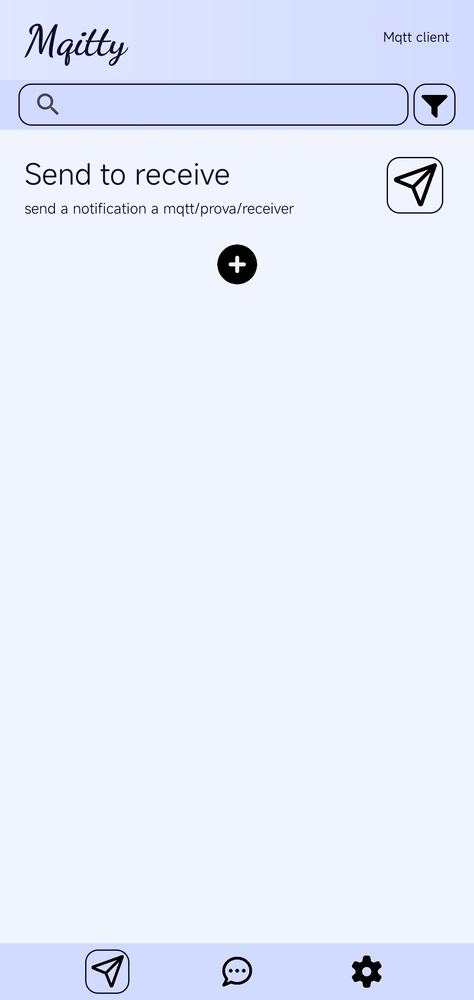
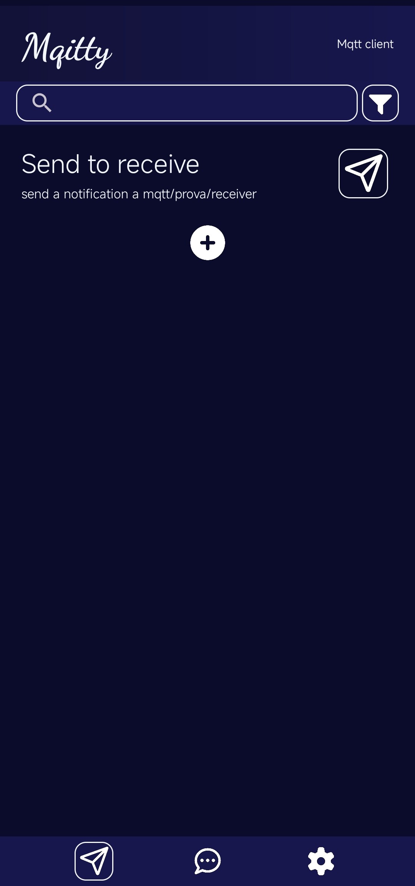

# Mqitty

<p align="center">
  
</p>

Mqitty is a lightweight, intuitive MQTT client for Android designed to help developers and IoT enthusiasts interact with their MQTT brokers effortlessly. Whether you need to send quick commands or monitor data streams, Mqitty provides a clean interface to manage your MQTT communications.

## 📸 Screenshots

| Light Mode | Dark Mode |
|:---:|:---:|
|  |  |


## ✨ Features

- **Topic Management**: Organize your publish and subscribe topics into separate, easy-to-access panels.
- **Reusable Templates**: Create "Send Models" for frequent commands so you don't have to re-type topics and payloads.
- **Chat-like Monitoring**: View incoming messages in a familiar chat interface for each subscription.
- **Persistent Subscriptions**: Keep listening for messages even when you're navigating other parts of the app.
- **Search & Filter**: Quickly find specific configurations or messages using the built-in search functionality.
- **Dynamic Theming**: Support for Light Mode, Dark Mode, and System Default.
- **Data Persistence**: All your brokers and configurations are stored locally using SQLite.

## 🚀 Getting Started

1. **Clone the repository**:
   ```bash
   git clone https://github.com/tommy-210/Mqitty.git
   ```
2. **Open in Android Studio**:
   Import the project and let Gradle sync.
3. **Build & Run**:
   Deploy the app to your Android device or emulator (API 24+ recommended).

#### Otherwise download the apk file from [Release]("https://github.com/tommy-210/Mqitty/releases") directly and run it on your phone

## 🛠 Usage

- **Sending Messages**: Navigate to the "Send" tab, add a new broker/topic configuration, and tap the send icon to publish a message.
- **Receiving Messages**: Navigate to the "Receive" tab, add a subscription, and tap the play button to start listening. Tap the subscription item to view the message history in the chat view.
- **Settings**: Customize the default startup panel, change themes, and set message cleanup intervals to keep your storage light.

## 📦 Built With

- **Java/Kotlin**: Core application logic.
- **Paho MQTT**: Reliable MQTT client library.
- **SQLite**: Local database for configuration and message storage.
- **Material Design**: For a modern and responsive UI.

## 📄 License

This project is licensed under the MIT License.
