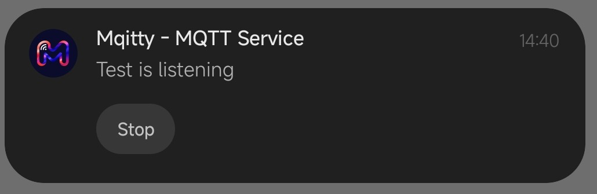
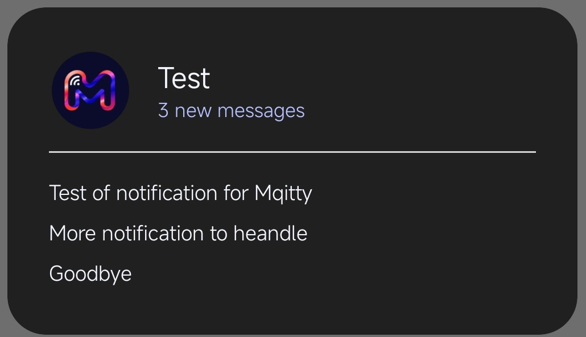

<p align="center">
  
</p>

# Mqitty

## 📋 Table of Contents

- [About](#ℹ️-about)
- [Technologies](#%EF%B8%8F-technologies)
- [Installation](#-installation)
- [Features](#-features)
- [Docs](#-documentation)
- [License](#-license)
- [Contact](#-contact)

## ℹ️ About

Mqitty is a lightweight, intuitive MQTT client for Android designed to help developers and IoT enthusiasts interact with their MQTT brokers effortlessly.
Whether you need to send quick commands or monitor data streams, Mqitty provides a clean interface to manage your MQTT communications.

---
## 🛠️ Technologies

This project is built with:

- **Java**: Core application logic.
- **Paho MQTT**: Reliable MQTT client library.
- **SQLite**: Local database for configuration and message storage.
- **Material Design**: For a modern and responsive UI.


---
## 📥 Installation

1. **Clone the repository**:
   ```bash
   git clone https://github.com/tommy-210/Mqitty.git
   ```
2. **Open in Android Studio**:
   Import the project and let Gradle sync.
3. **Build & Run**:
   Deploy the app to your Android device or emulator (API 24+ recommended).

#### Otherwise download the apk file from [Release]("https://github.com/tommy-210/Mqitty/releases") directly and run it on your phone

---
## ✨ Features

- **Topic Management**: Organize your publish and subscribe topics into separate, easy-to-access panels.
- **Reusable Templates**: Create "Send Models" for frequent commands so you don't have to re-type topics and payloads.
- **Chat-like Monitoring**: View incoming messages in a familiar chat interface for each subscription.
- **Persistent Subscriptions**: Continue listening to messages even while you navigate other sections of the app, outside the app, or even when your device is turned off, thanks to background operation.
- **Search & Filter**: Quickly find specific messages using the built-in search functionality. You can organize items by sorting them in various ways.
- **Dynamic Theming**: Support for Light Mode, Dark Mode, and System Default.
- **Data Persistence**: All your brokers and configurations are stored locally using SQLite.
- **Notification manager**: The app features notification management that allows you to monitor the progress of conversations.

<p align="left">
  
  
</p>

---
## 📜 Documentation

There is a section dedicated to **settings**, with which you can **configure** the app as best as possible, 
there is also a button to check if there are any updates available.

### Creation & modify Send / Receiver
> You can create Send or Receiver elements, and you can change them later.<br/>
> When you try to create new Send element, you will have to fill out a form like this.
>
> #### Send element:
>
> | Text Field  |                   Explanation                   |                  Example | 
> |:------------|:-----------------------------------------------:|-------------------------:|
> | Name        |           name of your send elements            |                Send Test |
> | Description |             description of element              | Send element to test app |
> | Broker      |          broker for message management          |           broker.emqx.io |
> | Topic       | topic to distinguish who to send the message to |         mqitty/test/send |
> | Message     |          the message you want to send           |                   Test-1 |
>
> #### Receiver element:
>
> | Text Field          |                 Explanation                  |                      Example | 
> |:--------------------|:--------------------------------------------:|-----------------------------:|
> | Name                |          name of your send elements          |                Receiver Test |
> | Description         |            description of element            | Receiver element to test app |
> | Broker              |        broker for message management         |               broker.emqx.io |
> | Topic               | topic to distinguish who to communicate with |         mqitty/test/receiver |
> | Enable notification |     choose which notifications to enable     |                       Custom |
> | Keyword to filter   |    is the keyword to filter notifications    |                       filter |
>
> The ```Keyword to filter``` text field is **enabled only if you choose Custom** in the notification selection

### Filter, Search & Sort
> At the top of each panel there is a search bar that allows you to **search** (by **name** and **description**) for a specific item.
> Instead, when you are **inside a chat** you can do the same search by clicking on the **three dots**.
> 
> You can decide how to **order the elements** based on the **name**, the **broker** and in a **custom** way (which is the creation way).

### ⚠️ Warnings

- **If a receiver is not listening, you will not receive any messages**, and these will be **lost** 
because Mqitty does not have a cloud database and does not store the messages.
- All messages traveling over the MQTT protocol are **UNENCRYPTED**, so **don't send personal messages**.

---
## 📄 License

This project is licensed under the MIT License - see the [LICENSE](LICENSE) file for details.

---
## 📧 Contact

Contributions are welcome!

If you want to suggest **new features** to add or **report a bug**, please contact me in the issues section.

**Author:** [tommy-210](https://github.com/tommy-210)
